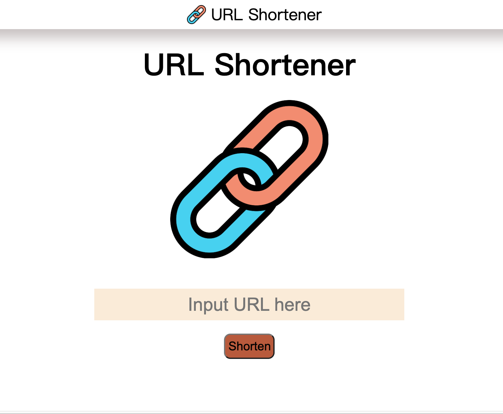

# URL Shortener

---

---

## 介紹

---

可將冗長的網址縮短，達到方便剪貼、辨識的功能

### 功能列表

---

- 使用者可以將網址貼在輸入格內，按下 Shorten 按鈕，就會顯示縮短後的網址
- 按下 copy 按鈕後，就可以將縮短後的網址複製到剪貼簿上，便於使用

---

### 開始使用

1. 請先確認有安裝 node.js 與 npm
2. 將專案 clone 到本地
3. 在本地開啟之後，透過終端機進入資料夾，輸入：
   `npm install`

4. 安裝完畢後，繼續輸入：
   `npm run start`
5. 若看見此行訊息則代表順利運行，打開瀏覽器進入到以下網址
   `URL_Shorter is running on http://localhost:3000`
6. 若欲暫停使用
   `ctrl + c`

### 開發工具

- Node.js 16.14.0
- Express 4.17.3
- Express-Handlebars 4.0.2
- Method-override 3.0.0
- Mongoose 6.2.5
